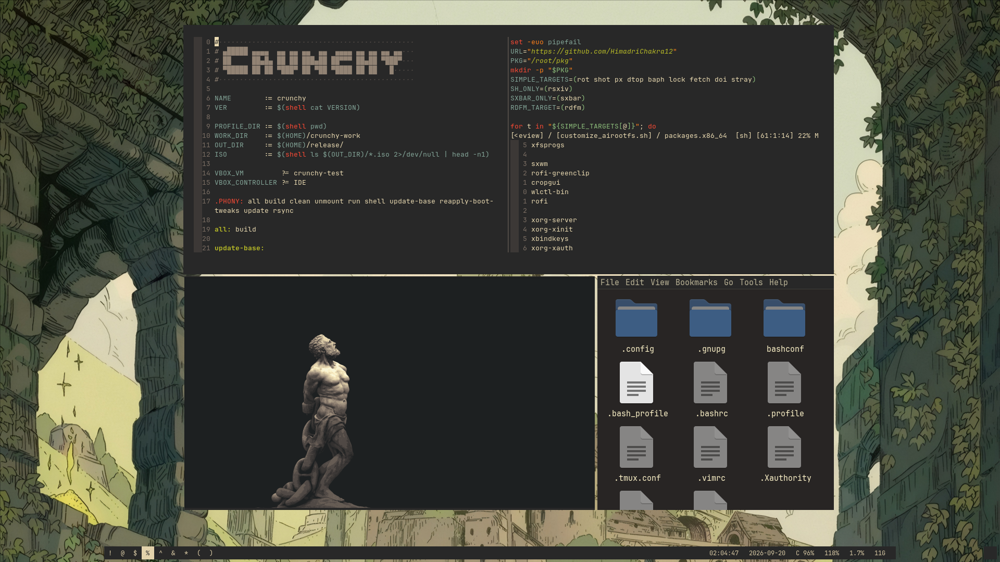

```
                                  ▄█████ ▄▄▄▄  ▄▄ ▄▄ ▄▄  ▄▄  ▄▄▄▄ ▄▄ ▄▄ ▄▄ ▄▄   
                                  ██     ██▄█▄ ██ ██ ███▄██ ██▀▀▀ ██▄██ ▀███▀   
                                  ▀█████ ██ ██ ▀███▀ ██ ▀██ ▀████ ██ ██   █
```



A small live iso, built for portability and easy accessability. It is mainly for personal use but its still maintained according to people's personalization and preferences.

## Center of the OS
    Along with the other basic tools and stuff for x11,
    
    the center of the whole live iso is:

    - [sxwm](https://github.com/uint23/sxwm) - The window manager
    - [rdfm](https://github.com/HimadriChakra12/rdfm) - The file manager
    - [wlctl](https://github.com/aashish-thapa/wlctl) - The TUI wifi manager
    - [lock](https://github.com/HimadriChakra12/lock) - The locker
    - [shot](https://github.com/HimadriChakra12/shot) - The screenshotter
    - [px](https://github.com/HimadriChakra12/px) - The color picker
    - [dtop](https://github.com/HimadriChakra12/dtop) - The top
    - [baph](https://github.com/HimadriChakra12/baph) - The AUR manager
    - [doi](https://github.com/HimadriChakra12/doi) - The notification Daemon
    - [stray](https://github.com/HimadriChakra12/stray) - The system Tray
    - [sxbar](https://github.com/uint23/sxbar) - The status bar
    - [rsxiv](https://github.com/HimadriChakra12/rsxiv) - The image viewer and wallpaper setter
    - [rot](https://github.com/HimadriChakra12/rot) - The terminal emulator

## GIT
Includes git + github-cli + lazygit, which is essetial for most people

## Firefox
Provides a initial profile so that all feels set and perfect, no new profile generation, just run and go.adds ublock origin by default. Might add librewolf to the repo and ship it with librewolf.
